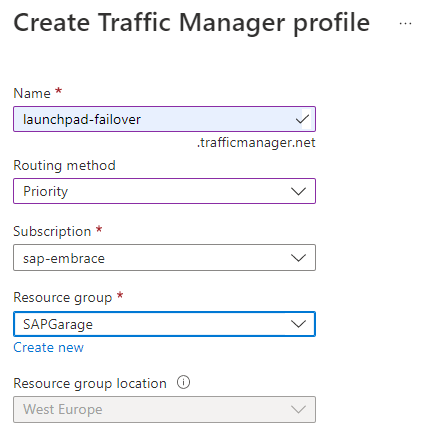
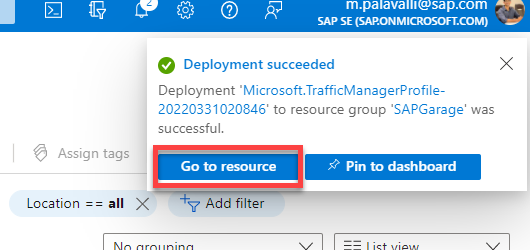
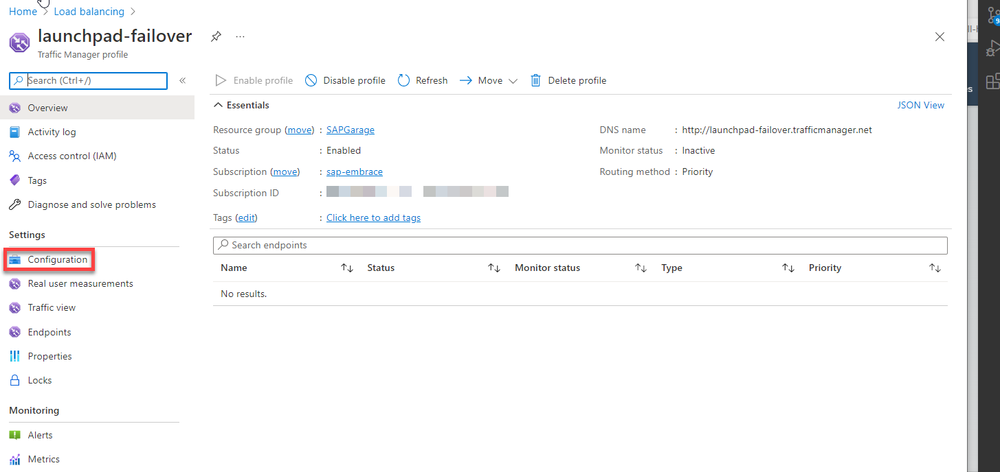
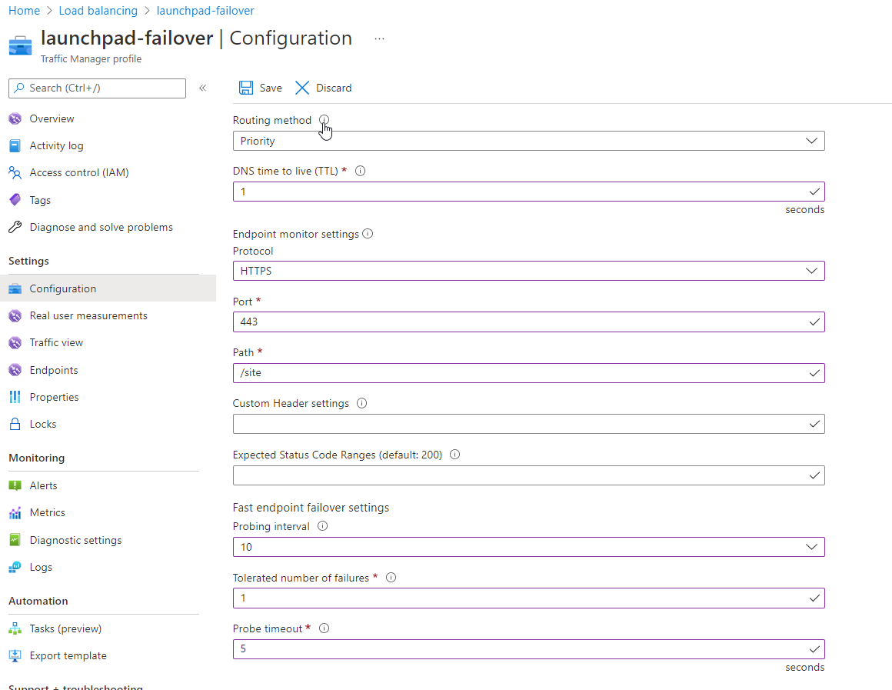
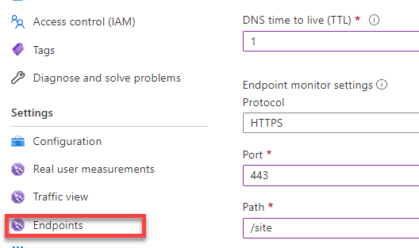
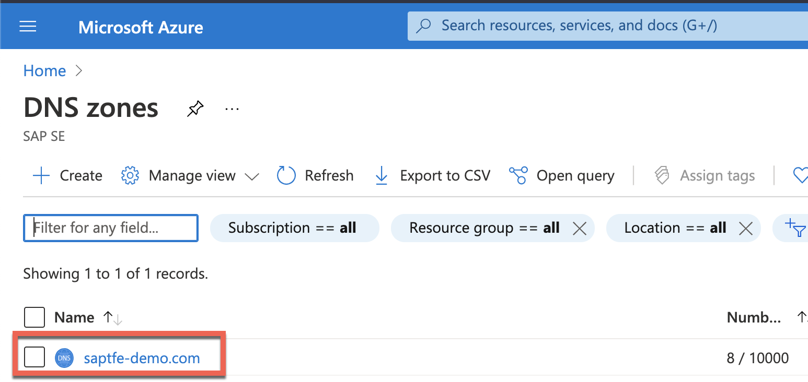
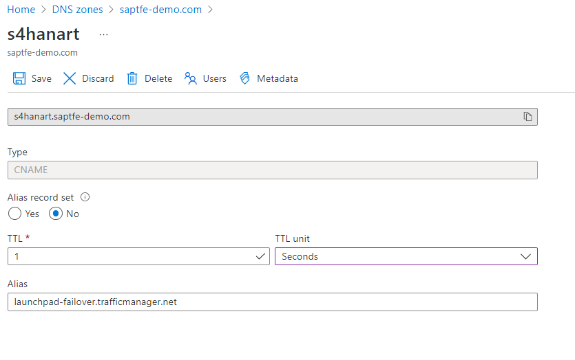

# Introduction

In this step, you will configure Azure Traffic Manager (actually the Azure Traffic Manager profile). The Azure Traffic Manager profile is the key component in this *intelligent routing* scenario, as it defines which SAP Launchpad service should be used when based on certain rules and policies. 

## Setup Azure Traffic Manager profile
1. Go to the [Azure Portal](http://portal.azure.com) and log in. 

2. Search for **Traffic Manager profile** and select the corresponding item.

    

3. **Create** a new Traffic Manager profile. 

    

4.  Provide a meaningful name (e.g. *launchpad-failover*) for the Azure Traffic Manager profile, select **Priority** as the Routing method and assign it to one of your subscriptions. If necessary, create a new Resource Group. 

    

5. Continue with **Create**. 

6. Wait until the deployment was successfully finished. Select **Go to resource** to navigate to the details of the profile.

    > Alternatively you can also refresh the list of all Azure Traffic Manager profiles and select the recently created Traffic Manager profile.

    

7. Select **Configuration** in the navigation area. 

    

8. Provide the following settings: 

    - Routing method: Priority
    - DNS time to live (TTL): 1
    - Protocol HTTPS
    - Port: 443
    - Path: /site
    - Expected Status Code Range: 200-200
    - Probing interval: 10
    - Tolerated number of failures: 1
    - Probe timeout: 5

    

    > **IMPORTANT**: Those settings enable the fastest failover that's possible based on DNS time to live & the **fast endpoint failover settings**. The more often the **monitor** endpoint (/site) the higher the number of messages the SAP Cloud Integration needs to handle. How often the monitor endpoint is called is defined by the combination of probe timeout and probing interval. Adjust the settings for your productive scenario depending on your needs. 

    > Note: The path you have defined is later on used to monitor every defined endpoint in the Azure Traffic Manager profile. The exact path is then concatenated with the endpoints target that we'll define in one of the subsequent steps. **/site* is the path of the SAP Launchpad service accessed in one of the previous exercises [previous exercises](../02-SetupMonitoringEndpoint/README.md#endpoint).

9. Continue with **Save**.

10. Select **Endpoints** in the navigation area. 

    

11. **Add** a new endpoint and set the following parameters:

    - Type: External endpoint
    - Name: Launchpad US
    - Fully-qualified domain name (FQDN) or IP: SAP Launchpad service URL for US subaccount (without any path)
    - Priority: 1

    > Note: The SAP Launchpad service URL is the FQDN name (without */site*) that you have also mapped in the [previous exercise](../03-MapCustomDomainRoutes/README.md#endpointmapping). 

    

12. You have created the first endpoint in the Azure Traffic Manager profile. **IMPORTANT: Repeat the Step 11 for the other SAP Launchpad service in the other SAP BTP region(s).**

13. Display **Overview** of your Azure Traffic Manager profile and copy the **DNS Name**. 

    

14. Go to the **DNS Zone** of your domain. 

    
    

15. Create a record set for the subdomain that [you have mapped to the SAP Launchpad service URL](../03-MapCustomDomainRoutes/README.md#endpointmapping): 

    - Name: subdomain that you have mapped to the SAP Launchpad Service URL
    - Type: CNAME
    - Alias Record Set: No
    - TTL: 1 Second (depending on your requirements, how fast a failover should be executed)
    - Alias: DNS Name of the Azure Traffic Manager profile that you have copied in Step 18 - without *http://*(e.g. http://launchpad-failover.trafficmanager.net)

    

16. Repeat **Step 16** by changing the **Name** to *'s4hanart'*. This is needed to load SAP GUI-based Fiori apps to SAP Launchpad service. **s4hanrt** is the runtime destination name that is created in the destinations.
    

17. You can now access the SAP Launchpad service URL using the custom domain.
  

  
Congratulations. You have created an Azure Traffic Manager profile that detects which tenant should handle the user requests based on a monitoring endpoint you have deployed (SAP Launchpad service URLs in both tenants) in one of the previous steps. All requests sent to the mapped route in Cloud Foundry (launchpad.example.com) are going to the Azure Traffic Manager profile because of the CNAME record set in the DNS Zone of the domain. Azure Traffic Manager then decides on the priority setting which tenant should handle the request. All of this happens on DNS level. (If you want to use the Azure Traffic Manager for other scenarios like loadbalancing, reducing latency or others - have a look at the [available routing methods](https://docs.microsoft.com/en-us/azure/traffic-manager/traffic-manager-routing-methods).)

