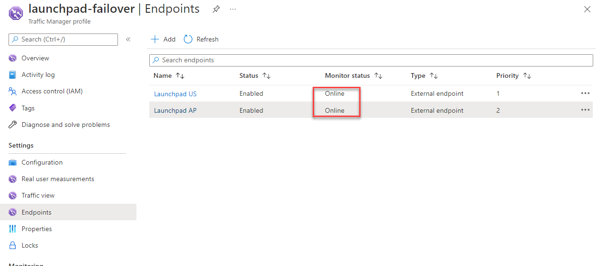
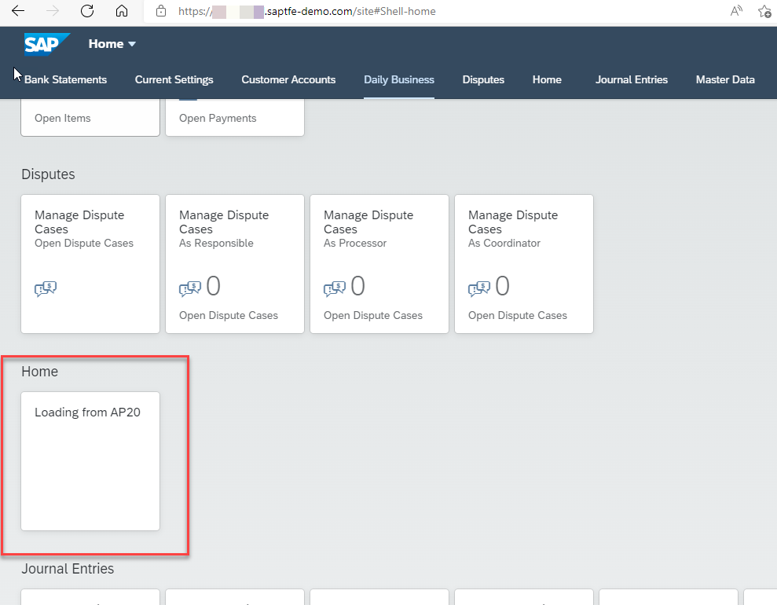
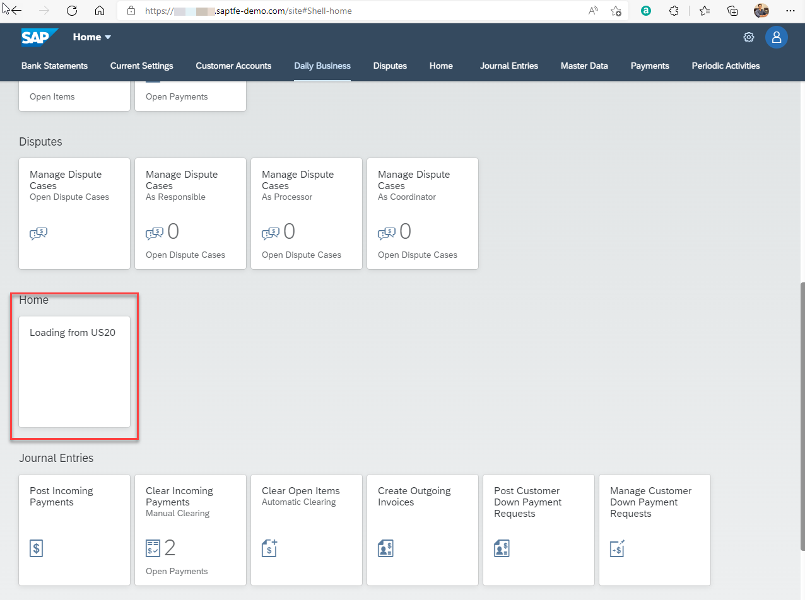

# Introduction

In this step you will test the recently created AWS Route 53 traffic policy. 

In the initial situation, both the SAP Launchpad services are available and your primary Launchpad service will process the requests. Then you simulate a situation where the primary Launchpad service is not available by manipulating the endpoint. Thus, the health check will no longer receive the expected response from the call (HTTP 200) and will consider the primary Launchpad service as offline. 
>Note: As the Launchpad service is a SAAS application, simulating failover will be difficult, for this reason, we will just manipulate the endpoint so the URL will not work.

Depending on the Failover & DNS TTL settings in the AWS Route 53 health check and traffic policy, the Secondary Launchpad service will process your upcoming requests after a certain time. The sender is effectively unaware of the process in the background, as it sends the requests to a domain regardless of the reachable tenants in the background.

## Test Failover scenario

1.  Go to the AWS Management console and open Route 53 Health checks. You can find the health check **LaunchpadAP10** status as **Healthy**

    

2.  Open your custom domain URL in the browser. You can see the tile **AP** loaded. (US Region Launchpad service)

    >URL: *https://yourroutename.yourdomainname.com/site* 

    

3.  Now open the health check **LaunchpadAP10** by selecting it and clicking the **Edit health check** button. Then manipulate the **Domain name** or **Port** to fail the health check (Simulation only as we cannot take down the standard SaaS application).

    
    

    >Note: In the screenshot, the port number is changed from **443** to **4433** to fail the health check.

4.  Now go back to your Launchpad service and refresh. 

    

    >Note: it might take a few seconds to minutes to reflect

Congratulations!! You have configured the AWS Route 53 traffic policy, provided the necessary endpoints as URLs of the SAP Launchpad service tenants in the failover scenario, and successfully integrated your own domain in this whole flow. You can also use other routing policies to use this setup as a DNS Loadbalancer or route the traffic depending on the geographical location or to decrease the latency.